# Capstone project: Image-Based Valuation of Used Clothing for Intrinsic-Value Matching in Second-Hand  Exchange Platforms

This project investigates whether photographs of used clothing can be analyzed to estimate intrinsic value and assign each item to a price range, enabling fair exchanges and automated recommendations in second-hand fashion marketplaces. The central business question is: Can a vision-based machine-learning system reliably classify used clothing into discrete value tiers such that items in the same tier are exchangeable and recommendable to users?

Full research can be found in [the notebook](data_exploration.ipynb) (possible [anaconda localhost](http://localhost:8889/lab/tree/pcmlai.capstone/data_exploration.ipynb?))

## High-level stages

1. Computer Vision Model for Clothing & Condition Recognition  \
   A Convolutional Neural Network (CNN) will be trained to identify both the item type (e.g., jeans, T-shirts, dresses) and an inferred condition score.

2. Market Price Classification Model  \
   Using the outputs from Stage 1, the project builds a supervised classification model that maps clothing features and inferred condition to a price-range label (e.g., <$10, $10-$25, $25-$50, >$50).

3. Explainability, Recommendation Layer, and Deployment Strategy  \
   Explainability:  \
   A local LLM (e.g., Llama-3-3B-Instruct) generates natural-language explanations using: model coefficients, classification probabilities, top k-nearest neighbors.  \
   Recommendation / Similarity Search:  \
   A K-Nearest Neighbor (KNN) vector search on the latent image embeddings returns 2–5 similar items as justification and added value to the user.

## Datasources

First two stages require prepared data to train the models. We end up with a total of 60GB of data.

1. Clothing & Condition Recognition  \
   The Kaggle DeepFashion (and DeepFashion2) dataset provides high resolution images and fine-grained clothing categories but lacks explicit “condition” labels. To adapt it, we will create a derived condition label (e.g., “as-new”, “gently 
used”, “worn”) using a combination of annotation of a small curated subset and synthetic data augmentation to simulate wear patterns.  \
   The original source from [mmlab.ie.cuhk.edu.hk](http://mmlab.ie.cuhk.edu.hk/projects/DeepFashion.html) is 30GB of images. Additionally Kaggle has 2 more datasets: 17GB and 6GB of images.

2. Market Price  \
   A second-hand pricing dataset is sourced by scraping used clothing listings from Poshmark and Depop (all other platforms have stronger scraping protections through Cloudflare and would require effort beyond the course timeline). Extracted metadata contains brand, category, condition description, size, sold price.  \
   We ended up scraping 13MB of data.

## Data analysis

### 1. Images

We have almost all images in a standardized shape of 300x300.
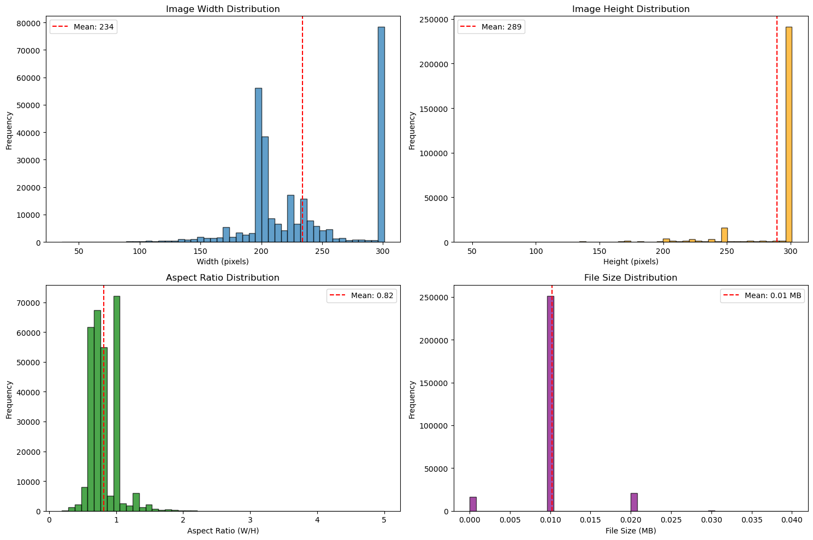

All images are already split into Training, Validation and Test sets.
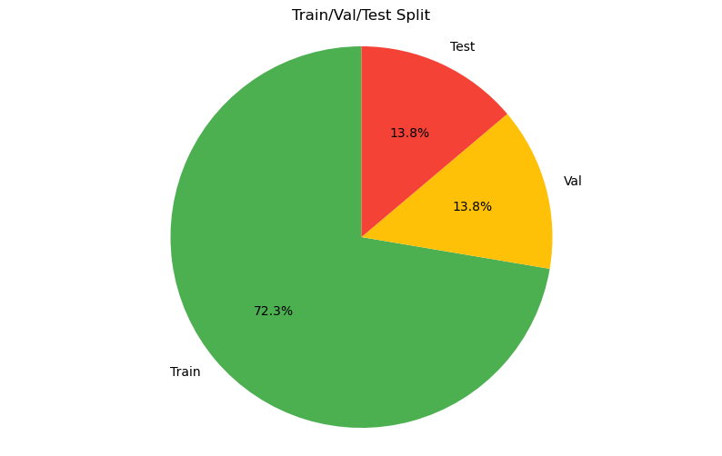

While all the source images are expected to have prestine condition, we've implemented sythentic transformation to degrade the condition of clothes. Testing of such degradation shows that indeed we can control the condition.
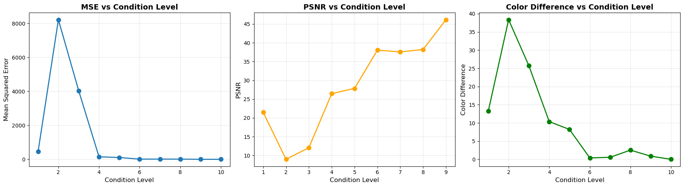

### 2. Prices

For the prices majority of data was scraped from one source.
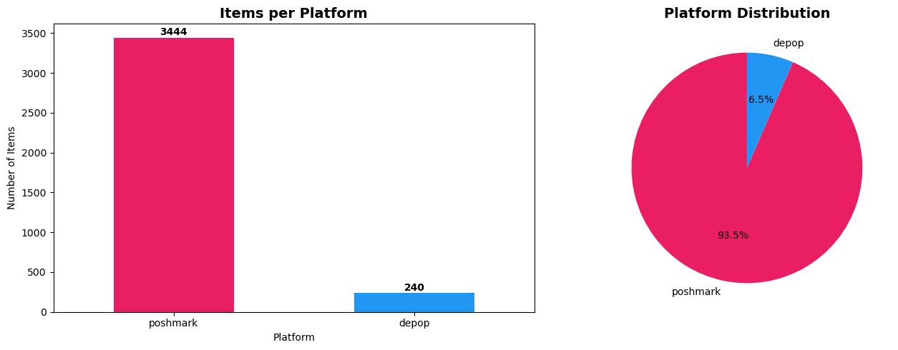

Dataset itself doesn't have much gaps as we prepared the scraper to consume as much information as possible.
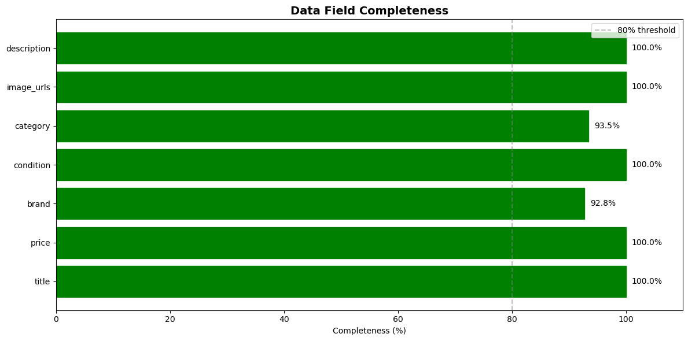

Overall price distribution resembles normal distribution with strong bias towards cheaper value, as expected for a used market.
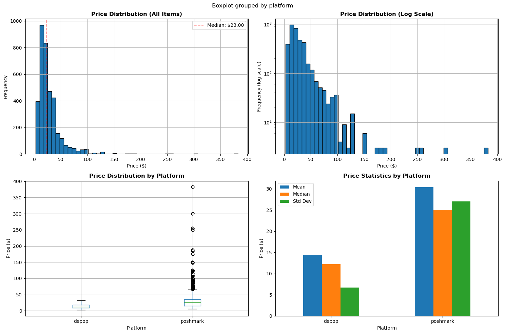

Next we are looking at different slices that may vary the price distribution.

**Brands**

Brands are fairly represented in the dataset.
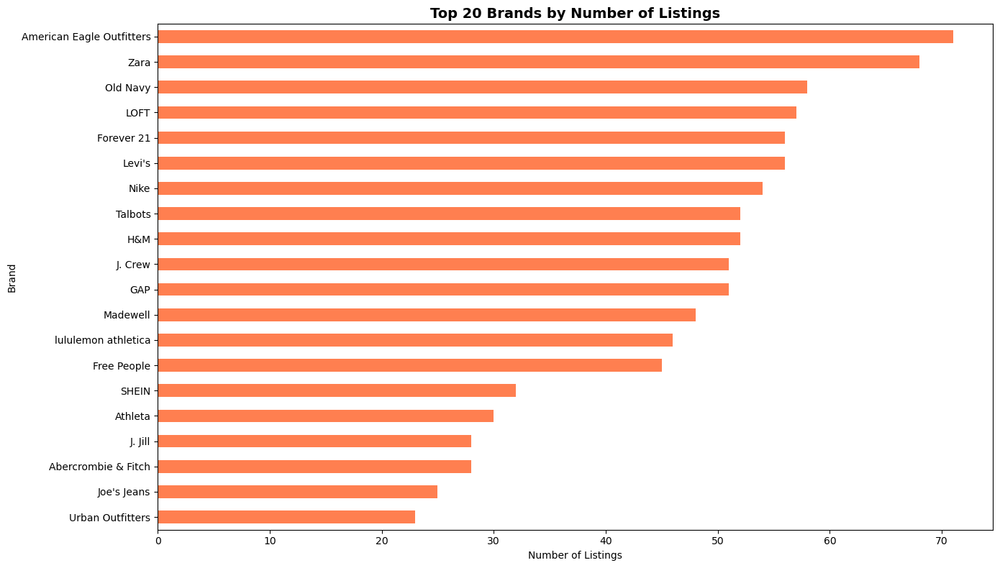
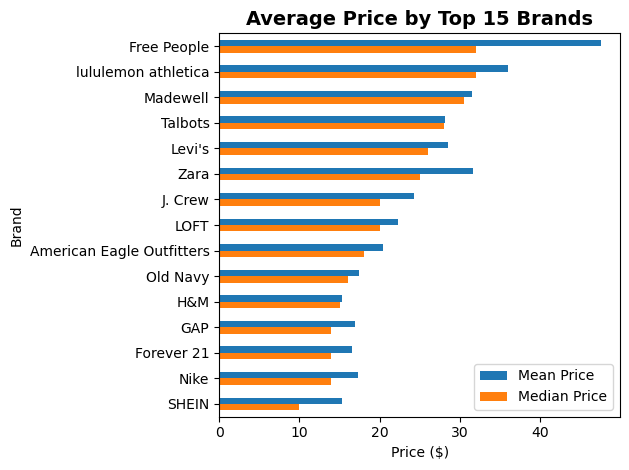

**Condition**

Condition feature is strongly skewed towards undefined "Used" value, whiich is a generic representation for the whole dataset.
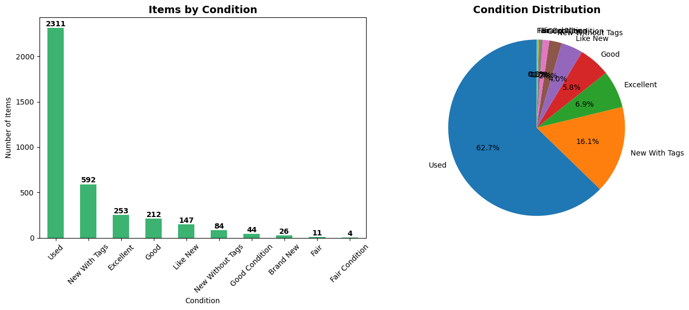
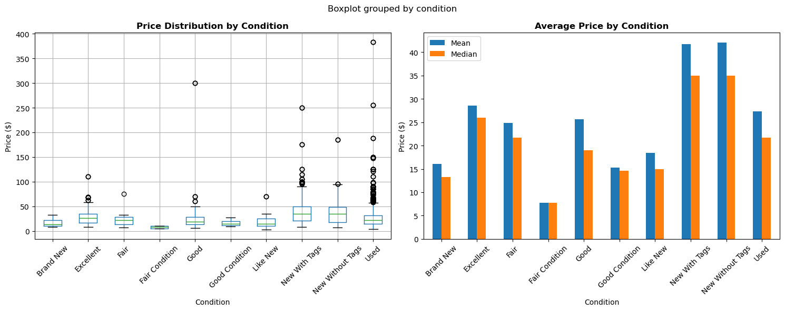

**Categories**

During scraping, specific categories were selected to make sure queries to all sites are well represented. Those were specifically: jeans, pants, dresses, skirt, shorts.
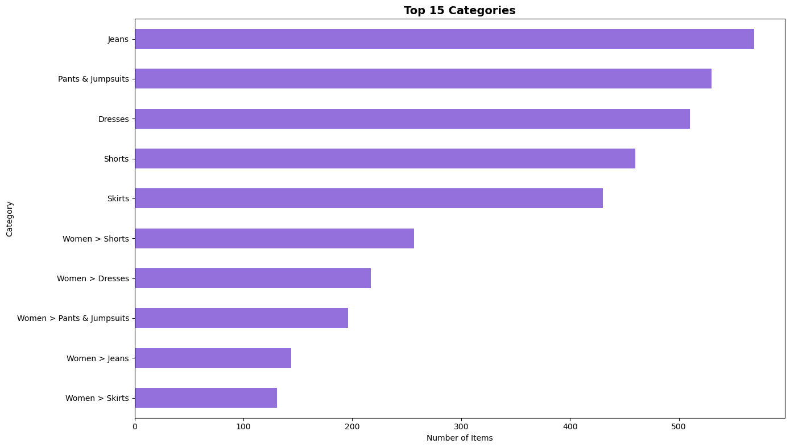

**Model**

As a base model Logistic Regression shows 78.8% accuracy.
We've used the OneHot encoder to prepare all the categorical columns: brand, category, color, size - all of them.
We've manually encoded price_bracket categories into integer price_bucket to maintain monotonous dependency between the trained output and actual semantical "more expensive" designation.
