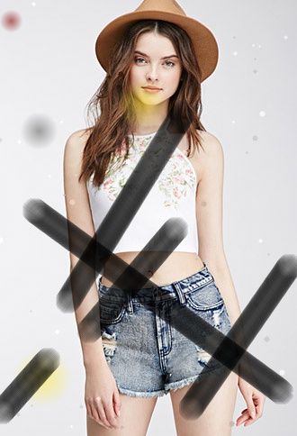
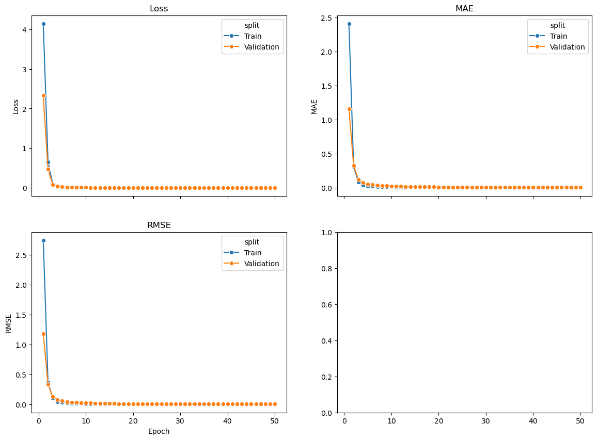
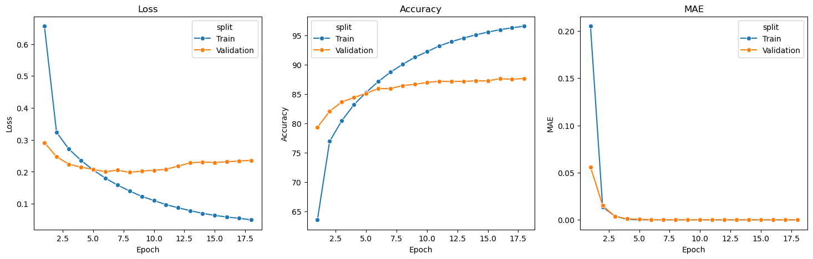
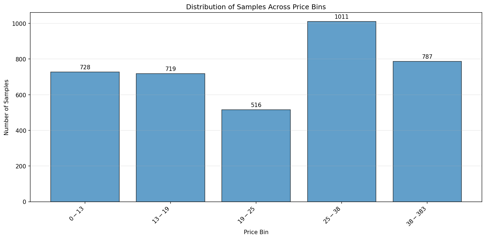
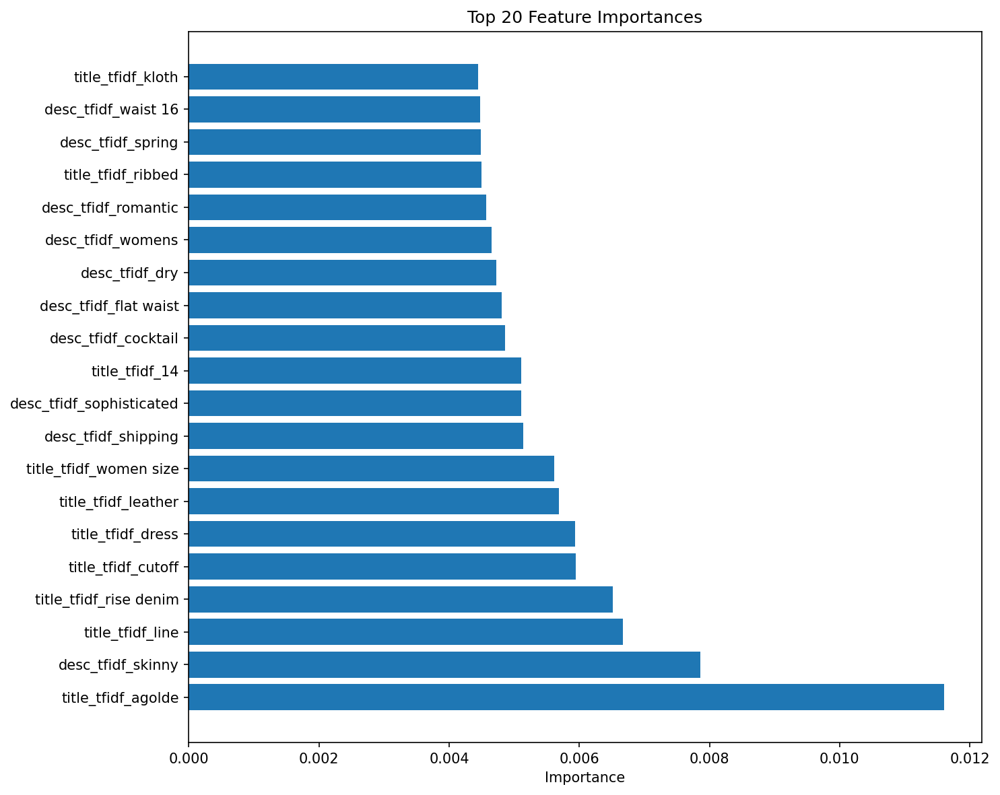
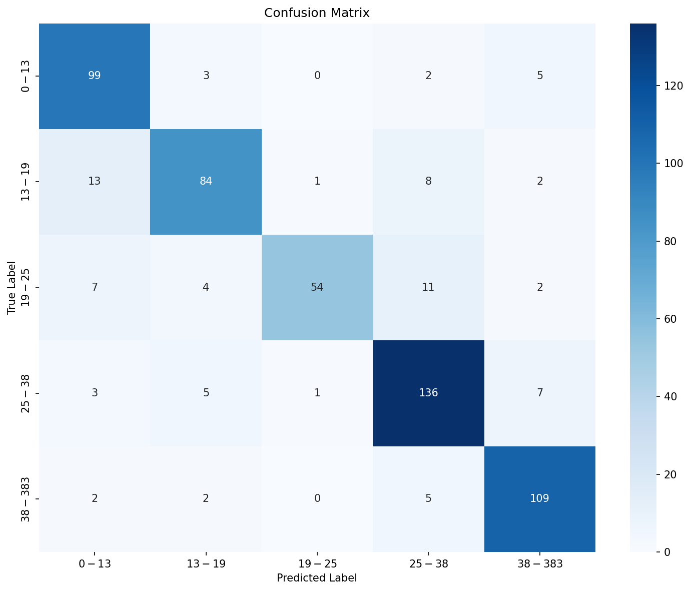

# Capstone project: Image-Based Valuation of Used Clothing for Intrinsic-Value Matching in Second-Hand  Exchange Platforms

This project investigates whether photographs of used clothing can be analyzed to estimate intrinsic value and assign each item to a price range, enabling fair exchanges and automated recommendations in second-hand fashion marketplaces. The central business question is: Can a vision-based machine-learning system reliably classify used clothing into discrete value tiers such that items in the same tier are exchangeable and recommendable to users?

## High-level stages

1. Computer Vision Model for Clothing & Condition Recognition 
A Convolutional Neural Network (CNN) will be trained to identify both the item type (e.g., jeans, T-shirts, dresses) and an inferred condition score.

2. Market Price Classification Model 
Using the outputs from Stage 1, the project builds a supervised classification model that maps clothing features and inferred condition to a price-range label (e.g., <$10, $10-$25, $25-$50, >$50).

3. Explainability, Recommendation Layer, and Deployment Strategy 
Explainability: 
A local LLM (e.g., Llama-3-3B-Instruct) generates natural-language explanations using: model coefficients, classification probabilities, top k-nearest neighbors.
Recommendation / Similarity Search: 
A K-Nearest Neighbor (KNN) vector search on the latent image embeddings returns 2–5 similar items as justification and added value to the user.

## Datasources

First two stages require prepared data to train the models. We end up with a total of 60GB of data.

1. Clothing & Condition Recognition
The Kaggle DeepFashion (and DeepFashion2) dataset provides high resolution images and fine-grained clothing categories but lacks explicit “condition” labels. To adapt it, we will create a derived condition label (e.g., “as-new”, “gently 
used”, “worn”) using a combination of annotation of a small curated subset and synthetic data augmentation to simulate wear patterns.

The original source from [mmlab.ie.cuhk.edu.hk](http://mmlab.ie.cuhk.edu.hk/projects/DeepFashion.html) is 30GB of images. Additionally Kaggle has 2 more datasets: 17GB and 6GB of images.

3. Market Price
A second-hand pricing dataset is sourced by scraping used clothing listings from Poshmark and Depop (all other platforms have stronger scraping protections through Cloudflare and would require effort beyond the course timeline). Extracted metadata contains brand, category, condition description, size, sold price.

We ended up scraping 13MB of data.

## Data analysis

### 1. Images

We have almost all images in a standardized shape of 300x300.

All images are already split into Training, Validation and Test sets.

While all the source images are expected to have prestine condition, we've implemented sythentic transformation to degrade the condition of clothes. Testing of such degradation shows that indeed we can control the condition.

### 2. Prices

For the prices majority of data was scraped from one source.

Dataset itself doesn't have much gaps as we prepared the scraper to consume as much information as possible.

Overall price distribution resembles normal distribution with strong bias towards cheaper value, as expected for a used market.

Next we are looking at different slices that may vary the price distribution.

**Brands**

Brands are fairly represented in the dataset.

**Condition**

Condition feature is strongly skewed towards undefined "Used" value, whiich is a generic representation for the whole dataset.

**Categories**

During scraping, specific categories were selected to make sure queries to all sites are well represented. Those were specifically: jeans, pants, dresses, skirt, shorts.

**Model**

As a base model Logistic Regression shows 78.8% accuracy.

## Implementation approach

Running everything in one Jupytier Notebook turned out to be not efficient, especially when it require restarting the whole kernel quite often.
Current project organization has scripts that can be executed either from Notebook by importing and giving correct parameters to "main" function, or from terminal by running it with python and giving exact same parameters.
The latter allows better parallelisation for tasks like scraping or downloading. As well as actually running training concurrently.
src folder contains the parts that required actual implementation effort:
* scrapers - their runtime is based on playwright crawler to open pages and parse their content.
* synthetic - to-be-improved algorithm that introduces random marks of wear and tear.
* vector search and llm - side implementations that are used by the api.
* api - the accessible portal to use the models for new customer inputs.

## Training process

### 1. Images

As a first step images received synthetic condition reduction by adding streaks of black lines, discoloration, artificial spots. This was a primitive algorithm that may be improved to better target true wear and tear effects.

There were 2 target values for which separate models were trained: 1) cloth type, 2) condition.
As image classification goes beyond the course material, I had searched for common approaches and chose PyTorch (due to having worked with it at my workplace).

**Cloth type**
With PyTorch I had several hyperparameters to adjust: 1) optimizer selection, 2) learning rate. Training just one model targeting cloth type produced:
|| Optimizer/Scheduler |||
|---|---|---|---|
|| AdamW/CosineAnnealingLR | AdamW/ReduceLROnPlateau | AdamW/StepLR | Adam/CosineAnnealingLR | Adam/ReduceLROnPlateau | Adam/StepLR | SGD/CosineAnnealingLR | SGD/ReduceLROnPlateau | SGD/StepLR |
| Train loss/acc | 1.0230 / 0.6931 | 1.0282 / 0.6971 | 1.0221 / 0.6931 | 1.0255 / 0.6940 |  1.0175 / 0.7013 | 1.0327 / 0.6931 | 3.0412 / 0.0586 | 2.8967 / 0.0971 | 2.8457 / 0.1507 |
| Validation loss/acc | 0.8126 / 0.7644 | 0.8242 / 0.7551 | 0.8189 / 0.7600 |  0.8069 / 0.7649 | 0.8143 / 0.7579 | 0.8108 / 0.7698 | 2.9260 / 0.0953 | 2.8389 / 0.1647 | 2.8215 / 0.2611 |
 
**Condition**
For condition training I chose to introduce distortions and transformations to the images. I purposefully had different distortions on training set (random rotations, flips, color changes) while keeping validation set a bit more realistic with just resizes.

Over epochs:

**Combined**
Lastly, I've attempted to train a single model that combines both categorizations. This multitask model training over the epochs:

### 2. Prices

Once again, the problem statement got narrowed down to categorization, where categories are defined as price buckets.
After analyzing 3000+ records, the selected buckets are: '\$0-\$13', '\$13-\$19', '\$19-\$25', '\$25-\$38', '\$38-\$383'

Out of many modern algorithms I chose 3 to try: XGBoost, LightGBM, Random Forest.
Running all three revealed XGBoost achieving the best results
| Model | Train Time (s) | Validation Accuracy | Validation F1 | Validation +/-1 | Test Accuracy | Test F1 | Test +/-1 |
|---|---|---|---|---|---|---|---|
| XGBoost | 3.26 | 0.8794 | 0.8770 | 0.9362 | 0.8531 | 0.8515 | 0.9327 |
| LightGBM | 2.79 | 0.8617 | 0.8603 | 0.9326 | 0.8478 | 0.8466 | 0.9292 |
| Random Forest | 0.32 | 0.6312 | 0.6153 | 0.7996 | 0.6336 | 0.6063 | 0.8319 |

The resulting feature importance:

And confusion matrix:

## Embedding for KNN and LLM Responses

To launch the API run start_api.ps1. Sadly, LLM and Vector integration requires a lot of manual setup and is not available as the end solution of this project.
